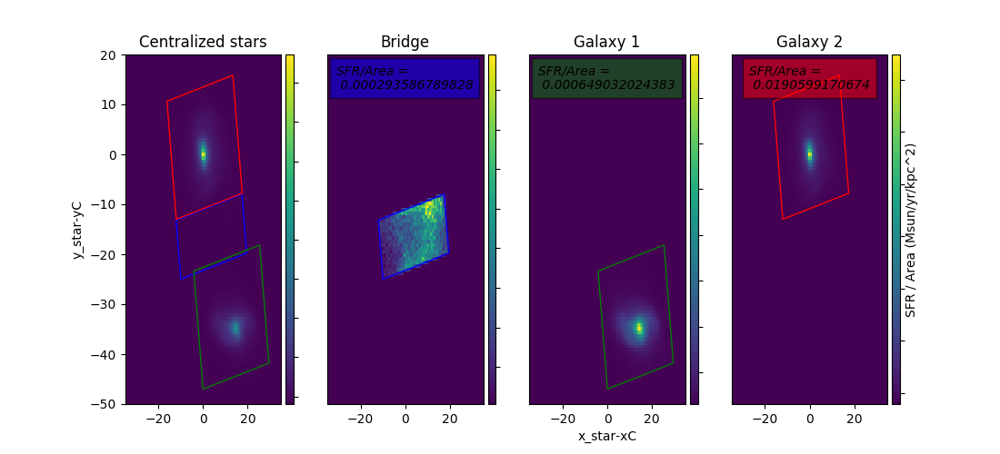

# Illustris Zoom Simulation

---

The main purpose of this project is to analyze the amount of star formation (SFR) taking place between merging galaxies 
(in the so-called 'bridge'), and calculating the ratio of the SFR to the area of the bridge.
This ratio is then compared to the equivalent ratios of each of the two merging galaxies. Next stage will be to evaluate the time evolution of SFR in this area.  

"The standard model of cosmology posits that the mass-energy density of the Universe is dominated by unknown forms of dark matter and dark energy. Testing this extraordinary scenario requires precise predictions for the formation of structure in the visible matter, which is directly observable as stars, diffuse gas, and accreting black holes. These components of the visible matter are organized in a 'Cosmic Web' of sheets, filaments, and voids, inside which the basic units of cosmic structure - galaxies - are embedded. To test our current ideas on the formation and evolution of galaxies, we strive to create simulated galaxies as detailed and realistic as possible, and compare them to galaxies observed in the real universe. By probing our successes and failures, we can further enhance our understanding of the galaxy formation process, and thereby perhaps realize something fundamental about the world in which we live.

The Illustris project is a set of large-scale cosmological simulations, including the most ambitious simulation of galaxy formation yet performed. The calculation tracks the expansion of the universe, the gravitational pull of matter onto itself, the motion or "hydrodynamics" of cosmic gas, as well as the formation of stars and black holes. These physical components and processes are all modeled starting from initial conditions resembling the very young universe 300,000 years after the Big Bang and until the present day, spanning over 13.8 billion years of cosmic evolution. The simulated volume contains tens of thousands of galaxies captured in high-detail, covering a wide range of masses, rates of star formation, shapes, sizes, and with properties that agree well with the galaxy population observed in the real universe. We are currently working to make detailed comparisons of our simulation box to these observed galaxy populations, and some exciting promising results have already been published." 
(http://www.illustris-project.org/about/)
